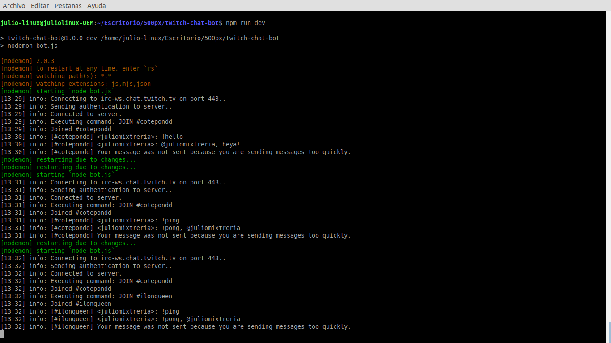
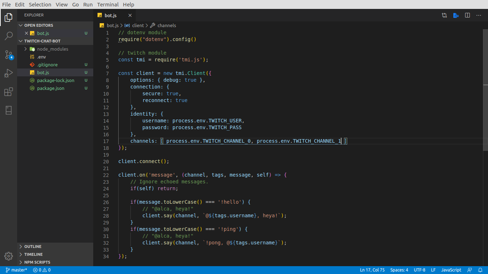

# TWITCH CHAT BOT

bot de codigo abierto para el realizar chatbots con nodejs para la realizacion de chat bot en twitch usando variables de etorno

## NPM modules:

* tmi.js
* dotenv
* nodemon *solo para desarrollo*

para el desarrollo  o aportar de bot se debe conocer nodejs, es6+ y variables de entorno

ejemplos:

ejecución del script

desarrollando el codigo

> para desplegar el chat bot de twitch debes usar servidores dedicados o PaaS como ejemplo: *Heroku*

links: 

[twitch tmi token](https://twitchapps.com/tmi/)
[tmi.js github repo](https://github.com/tmijs/tmi.js)
[twitch developers portal](https://dev.twitch.tv/)

licencia __*MIT*__